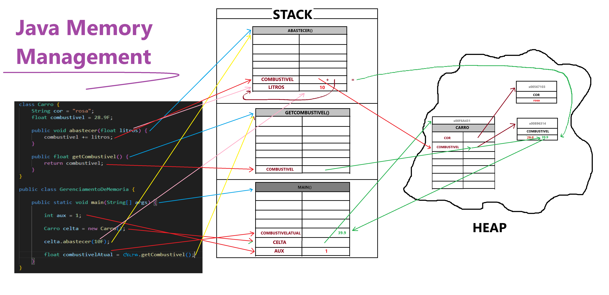

# Gerenciamento de Memória em Java

Visando performance, a JVM (Java Virtual Machine) divide a memória em duas partes, uma denominada "stack" e a outra "heap".

### Stack

A stack utiliza-se do princípio LIFO (Last In First Out) para armazenar dados e é subdividade em dois arrays, um deles com a referência para valores, e o outro com os dados em si. O relacionamento entre as referências e dados armazenadas na stack funciona de forma semelhante à dinâmica entre as chaves e seus valores em uma Hash Table.

A JVM criará uma stack para cada método, dentro da stack, as chaves/referências serão compostas pelos identificadores das variáveis, e os valores da stack serão compostos pelos dados armazenados nas variáveis (valores atribuídos às variáveis).

### Heap

A memória heap armazena os objetos e as variáveis de instância do programa

## Exemplo

```
class Carro {
    String cor = "rosa";
    float combustivel = 28.9F;

    public void abastecer(float litros) {
        combustivel += litros;
    }

    public float getCombustivel() {
        return combustivel;
    }
}

public class GerenciamentoDeMemoria {

    public static void main(String[] args) {

        int aux = 1;
        Carro celta = new Carro();
        celta.abastecer(10F);
        float combustivelAtual = celta.getCombustivel();
    }
}
```

