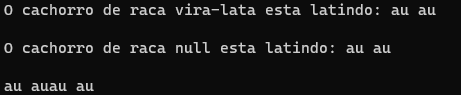

# Static Keyword e Métodos Estáticos

Métodos estáticos são métodos de classe e não de instância.

A "static" keyword significa que estamos criando algo o membro de uma classe e não de instância. Logo, não é possível chamar métodos não estáticos de uma classe sem uma instância dessa classe.

Além disso, não é possível utilizar uma variável não estática - ou seja, uma variável de instância - dentro de um método estático. Sendo assim, você teria que transformar a variável de instância em uma variável local do método estático durante a definição do método, passando as variáveis como argumentos.

Um bom exemplo de método estático é o método main() da principal classe de um programa, se o método main() não fosse estático, uma instância da classe principal teria de ser instânciada para que o método fosse chamado, mas tendo em vista que o método main() é o ponto de partida do programa, isso não seria possível.

Logo o método main() é estático, assim pode ser chamado diretamente a partir de sua classe.

Observe outro exemplo abaixo:

**Código:**

```
class Cachorro {

    String raca;
    static String latido = "au au";

    static void latir(Cachorro cachorro) {
        System.out.println("O cachorro de raca " + cachorro.raca + " esta latindo: " + latido);
    }

    static void latir2() {
        System.out.println(latido + latido);
    }
}

public class MetodosEstaticos {
    
    public static void main(String[] args) {

        Cachorro caramelo = new Cachorro();
        caramelo.raca = "vira-lata";

        Cachorro.latir(caramelo);
        System.out.println();

        Cachorro.latir(new Cachorro());
        System.out.println();

        Cachorro.latir2();
    }
}
```

**Saída de execução:**

