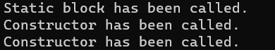

# Static Block em Java

O bloco "static" em Java, serve para inicializar variáveis estáticas, ou seja, variáveis de classe de uma determinada classe.

Quando criamos um objeto em Java, duas etapas ocorrem. Primeiramente a classe é carregada pelo Class Loader da JVM, e posteriormente o objeto é instanciado. O processo de carregamento da classe ocorre apenas uma vez, tendo em vista que o class loader da JVM registra a classe.

Logo, o static block será executado apenas uma vez, tendo em vista que a classe é carregada apenas uma vez no programa, mesmo que outros outros objetos da mesma classe sejam instânciados. Além disso, o static block será executado antes do construtor.

Para exemplificar esse fato, instanciamos dois objetos de uma classe, e utilizamos a função System.out.println() no bloco "static" e dentro do construtor da classe, e pudemos observar que embora o construtor tenha sido chamado duas vezes, o static block foi chamado apenas uma vez, observe:

**Código:**

```
class Carro {
    static byte qtdRodas;
    String fabricante;
    String anoFabricacao;
    String anoModelo;

    public Carro() {
        fabricante = "";
        anoFabricacao = "0000";
        anoModelo = "0000";

        System.out.println("Constructor has been called.");
    };

    static {
        qtdRodas = 4;

        System.out.println("Static block has been called.");
    };
    
}

public class StaticBlockEConstrutores {
    
    public static void main(String[] args) {

        Carro carro1 = new Carro();
        Carro carro2 = new Carro();
    }
}
```

**Saída de execução:**



Como podemos observar, o static block foi chamado antes do construtor e apenas uma vez, independentemente da classe ter sido instanciada duas vezes.

## Class.forName();

É possível carregar uma classe sem a necessidade de criar uma instância para a mesma utilizando o método forName() da classe "Class".

Veja o exemplo abaixo:

**Código:**

```
class Carro {
    static byte qtdRodas;
    String fabricante;
    String anoFabricacao;
    String anoModelo;

    static {
        qtdRodas = 4;

        System.out.println("Static block has been called.");
    };

    public Carro() {
        fabricante = "";
        anoFabricacao = "0000";
        anoModelo = "0000";

        System.out.println("Constructor has been called.");
    };
    
}

public class StaticBlockEConstrutor {
    
    public static void main(String[] args) throws ClassNotFoundException {

        Class.forName("Carro");

    }
}
```

**Saída de execução:**


Como podemos observar, a classe foi carregada pois System.out.println() dentro do static block foi executado, mas a classe não foi instânciada, pois o System.out.println() dentro do construtor não foi chamado.