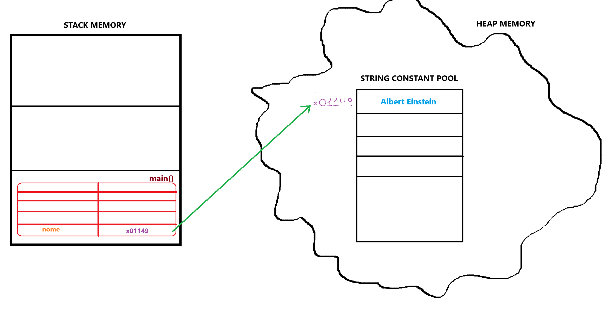
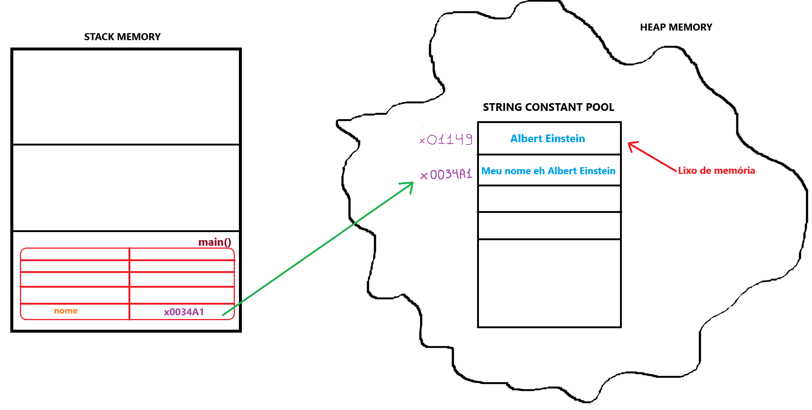
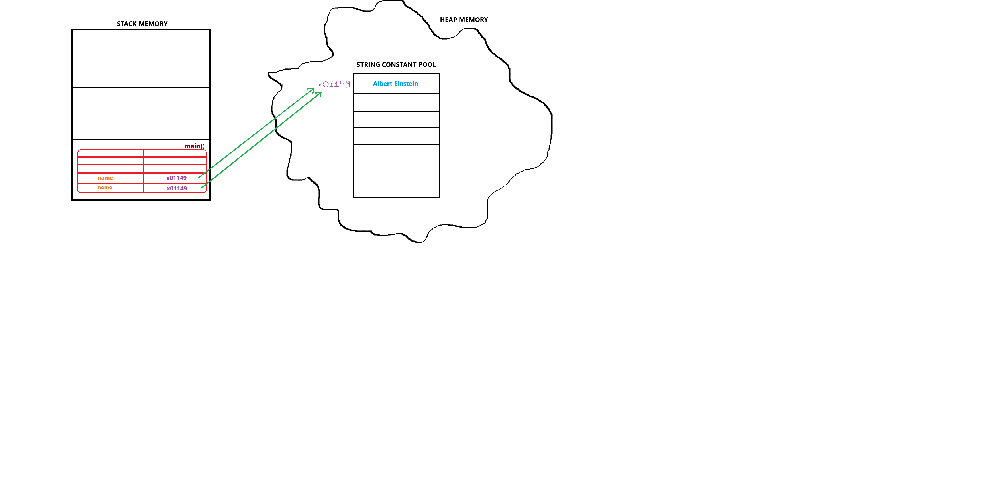
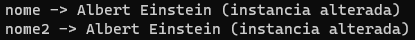
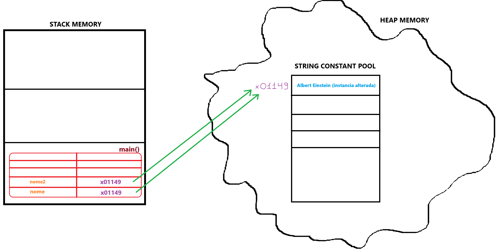

# Strigs em Java, mutáveis ou não?

Em Java, por padrão strings são imutáveis.

Quando criamos uma instância da classe String em Java, o que ocorre é que o identificador escolhido pelo programador no momento de instanciamento da classe, irá servir como chave para um valor dentro da stack memory. 

O Valor armazenado na stack memory será a referência para o endereço de memória do objeto string instânciado, que está armazenado na memória heap.

Observe os cógidos abaixo e os compare com suas respectivas ilustrações:

```
public class StringsEmJava {
    
    public static void main(String[] args) {

        String nome = "Albert Einstein";
    }
}
```



Quando alteramos uma instância da classe String, definindo outro valor para a mesma ou concatenando o objeto com outra string, um novo objeto é criado.

Ou seja, o objeto original não é alterado, ele se tornará elegível para limpeza de lixo de memória, e provavelmente será removido após certo tempo para obtenção de mais espaço livre de memória.

Observe:

```
public class StringsEmJava {
    
    public static void main(String[] args) {

        String nome = "Albert Einstein";

        nome = "Meu nome eh " + nome;
    }
}
```



# StringBuffer & StringBuilder

São classes que permitem instanciar strings mutáveis.

Observe os exemplos abaixo e suas representações:

```
public class StringsEmJava {
    
    public static void main(String[] args) {

        StringBuffer nome = new StringBuffer("Albert Einstein");
        StringBuffer nome2 = nome;
    }
}
```



Uma vez que a instância é alterada por qualquer uma das variáveis, ambas tem seu valor alterado, tendo em vista que o objeto será alterado e não será criado outro objeto.

Observe:

**Código:**

```
public class StringsEmJava { 
    public static void main(String[] args) {

        StringBuffer nome = new StringBuffer("Albert Einstein");
        StringBuffer nome2 = nome;

        nome.append(" (instancia alterada)");

        System.out.println("nome -> " + nome);
        System.out.println("nome2 -> " + nome2);
    }
}
```

**Saída de execução:**



**Ilustração do gerenciamento de memória:**

