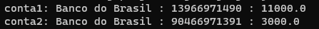

# Static Keyword e Variáveis Estáticas

Uma variável estática é compartilhada com todas as instâncias de uma dada classe. Por isso devemos chamar essas variávels a partir do identificador da própria classe e não com os identificadores de suas instâncias, podemos fazer isso, mas devemos evitar.

A "static" keyword significa que estamos criando algo o membro de uma classe e não de instância.

Observe o exemplo abaixo:

**Código:**

```
class Poupanca {
    
    static String banco;
    String cpf;
    double saldo;
}

public class VariaveisEstaticas {
    
    public static void main(String[] args) {

        Poupanca conta1 = new Poupanca();
        Poupanca conta2 = new Poupanca();

        //Aqui deveriamos utilizar Poupanca.banco e não conta1.banco
        conta1.banco = "Bradesco";
        conta1.cpf = "13966971490";
        conta1.saldo = 11000;

        conta2.banco = "Santander";
        conta2.cpf = "90466971391";
        conta2.saldo = 3000;

        System.out.println("conta1: " + conta1.banco + " : " + conta1.cpf + " : " + conta1.saldo);
        System.out.println("conta2: " + conta2.banco + " : " + conta2.cpf + " : " + conta2.saldo);
    }
}
```

**Saída de execução:**


Observe que mesmo que apenas a variável de instância "banco" no objeto "conta2" tenha sido inicializada com o valor "Santander", o atributo foi alterado em ambas as instâncias da classe.

Além disso, a iniciliazação da variável de instância deveria ter utilizado o identificador da própria classe, como no exemplo abaixo:

**Código:**

```
class Poupanca {
    
    static String banco;
    String cpf;
    double saldo;
}

public class VariaveisEstaticas {
    
    public static void main(String[] args) {

        Poupanca conta1 = new Poupanca();
        Poupanca conta2 = new Poupanca();

        Poupanca.banco = "Banco do Brasil";

        conta1.cpf = "13966971490";
        conta1.saldo = 11000;

        conta2.cpf = "90466971391";
        conta2.saldo = 3000;

        //Aqui também deveria ser Poupanca.banco, deixei assim apenas para fins didáticos
        System.out.println("conta1: " + conta1.banco + " : " + conta1.cpf + " : " + conta1.saldo);
        System.out.println("conta2: " + conta2.banco + " : " + conta2.cpf + " : " + conta2.saldo);
    }
}
```

**Saída de execução:**

