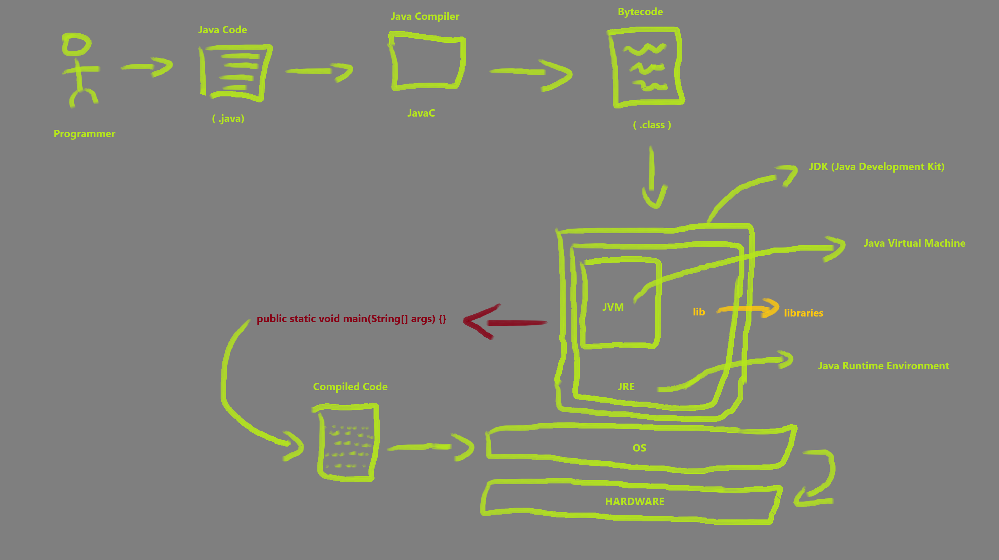

# Processo de Execução de Um Programa Java

1. O programador escreve o código fonte em um arquivo (.java)
2. Após compilar o arquivo .java com um compilador Java, um arquivo bytecode (.class) é gerado
3. A JVM instalada no sistema recebe o bytecode e o compila para um arquivo em código binário para que o sistema operacional execute o programa

## Java e Orientação a Objetos

Em Java tudo é um objeto e para criarmos objetos classes são necessárias. Sendo assim, todo arquivo java deve conter uma única classe pública - embora possa possuir outras classes não públicas -, essa classe pública deve ser nomeada exatamente com o mesmo nome do arquivo .java que a contém.

Embora seu projeto java possa possuir vários arquivos, a JVM sempre executa primeiramente o arquivo do seu projeo que possui método main. Logo, o primeiro arquivo a ser executado deve conter o método main, não somente deve possuir o método main, mas deve conter o método main com a assinatura "**public static void *main*(String[] args) {}**" em específica.

## Java, compilada ou interpretada?

Java é uma linguagem compilada e interpretada, tendo em vista que ela realiza o processo de compilação do código fonte - resultando um Bytecode (arquivo .class) - e também interpreta, tendo em vista que a JVM do sistema que irá executar o programa em questão, interpreta o Bytecode compilado previamente.

