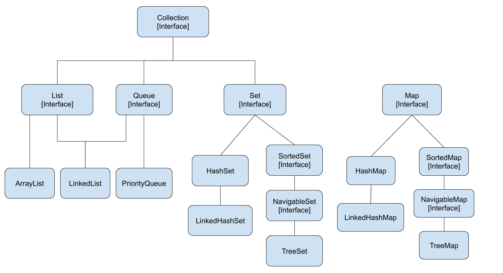

# Collections API ou Collections Framework em Java (Conceito)

Em termos amplos, uma Collections API (Interface de Programação de Aplicações) refere-se geralmente a um conjunto de classes e interfaces em uma linguagem de programação que fornece implementações de estruturas de dados comuns, como listas, conjuntos, mapas, filas, etc. Essas estruturas de dados são organizadas de uma maneira que as torna fáceis de usar e manipular.

No contexto do Java, por exemplo, a Collections API é um framework que consiste em um conjunto de interfaces e classes no pacote java.util. Ele fornece uma maneira padronizada de trabalhar com coleções de objetos. Algumas interfaces-chave na API de Coleções Java incluem List, Set, Map, etc., e algumas classes comuns incluem ArrayList, LinkedList, HashSet, HashMap, etc.

Foi introduzida à linguagem a partir da segunda versão do Java (versão 1.2), possibilitando o uso de multiplas estruturas de dados a partir do uso de algumas classes e interfaces.

A API de Coleções simplifica o processo de armazenar, recuperar e manipular grupos de objetos, e ela fornece uma maneira consistente e padronizada de lidar com coleções em diferentes estruturas de dados.

Vale ressaltar que o termo "Collections API" pode ser utilizado no contexto de outras linguagens de programação também, e os detalhes podem variar dependendo da linguagem. A ideia geral, no entanto, é fornecer um conjunto de ferramentas para trabalhar com coleções de dados de maneira consistente e eficiente.

### Collection API/Framework e Objetos

Por padrão a Collection API trabalha com objetos, utilizamos o generate "<>" para especificar o tipo de objeto que estamos trabalhando em uma determinada estrutura.

# Collection (Interface)

É uma interface Java que implementa a interface Iterable. Algumas classes Java imersas no conceito Collections API/Framework implementam a interface Collection.

# Collections

É uma classe Java, possui diversos métodos úteis com os quais podemos trabalhar.

## Hierarquia Collections API/Framework em Java

