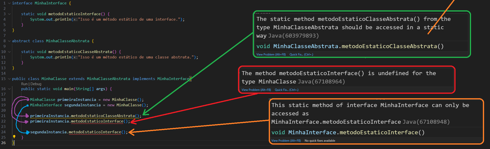

# Interfaces em Java

Interfaces em Java são tipos de referências abstratas que podem possuir métodos e atributos definidos, implementados e/ou inicializados de maneira tal que as interfaces sirvam primordialmente de guias para implementações de outras classes, especificando indicadores de quais comportamentos essas outras classes devem implementar. Interfaces são geralmente comparadas a manuais e contratos.

Interfaces são semelhantes a classes abstratas, no sentido em que podem ser utilizadas para especificar o tipo de uma variável mas que não podem criar objetos de forma direta, ou seja, interfaces não podem ser instanciadas. A interface, diferentemente de uma classe abstrata, não é extendida/herdada mas sim implementada por outras classes.

Embora uma classe Java não possa ter mais que uma herança, ou seja, extender mais que uma superclasse, classes em Java podem implementar N interfaces. Sendo assim, dada a impossibilidade de herança multipla na linguagem, uma maneira de implementar em uma dada classe diferentes comportamentos de diferentes classes, é atravez do uso e implementação de interfaces.

## Interfaces e atributos

Todos os atributos de uma interface são por padrão, e obrigatoriamente, públicos, estáticos e finais. Consequentemente, todo atributo de uma interface é um atributo de instância, constante e deve ser inicializado.

## Interfaces e métodos abstratos

Por padrão, todo método de uma interface é definido como público e abstrato, porém a partir do Java 8 e 9, outros tipos e modificadores de acesso foram habilitados para uso nos métodos de interfaces.

## Interfaces e os métodos concretos

A introdução de métodos concretos e estáticos (default methods & static methods) em interfaces a partir do Java 8 teve como objetivo principal fornecer uma maneira de evoluir bibliotecas e frameworks sem quebrar a compatibilidade com versões anteriores.

Antes do Java 8, quando as interfaces só podiam ter métodos abstratos (sem implementação), a adição de um novo método em uma interface significava que todas as classes que a implementavam precisavam ser atualizadas para fornecer uma implementação para esse novo método. Isso poderia ser problemático em sistemas grandes e complexos, especialmente em bibliotecas utilizadas por terceiros, onde você não tem controle sobre todas as classes que implementam a interface.

Ao introduzir métodos concretos em interfaces, a equipe de desenvolvimento do Java permitiu que interfaces fossem expandidas sem quebrar o código existente. Classes que implementam essas interfaces não são obrigadas a fornecer uma implementação para métodos concretos, pois eles já têm uma implementação padrão fornecida pela interface.

No entanto, se uma classe que implementa a interface deseja fornecer uma implementação diferente ou específica para um método concreto, ela tem a opção de fazer isso, simplesmente fornecendo uma implementação própria. Se a classe não fornecer uma implementação específica, ela herda automaticamente (com exceção dos métodos privados) a implementação padrão fornecida pela interface.

Isso proporciona uma flexibilidade significativa e facilita a evolução de bibliotecas e APIs sem causar impacto nos clientes existentes. No entanto, é importante usar métodos concretos com cuidado para garantir que não haja ambiguidades ou problemas de herança múltipla.

### Métodos concretos padrão **(default)** em interfaces Java

Adicionados às interfaces Java a partir do Java 8, são os métodos concretos definidos por padrão e obrigatoriamente como públicos. Ou seja, embora utilizem a keyword *default*, não se enganem, eles são obrigatoriamente definidos como públicos de maneira implicita.

### Métodos estáticos **(static)** em interfaces Java

Adicionados às interfaces Java a partir do Java 8, são os métodos concretos definidos por padrão como públicos, embora também possam ser definidos como privados.

Esses métodos, são métodos de instância e podem ser chamados pela assinatura da própria interface como no exemplo abaixo:

**Código:**

```
interface MinhaInterface {

    static void digaOi() {
        System.out.println("Oi, sou um metodo estatico de uma interface.");
    }
}
public class MinhaClasse {
    
    public static void main(String[] args) {
        
        MinhaInterface.digaOi();
    }
}
```

**Saída de execução:**


Instâncias de classes que implementam interfaces não podem chamar os métodos estaticos das interfaces, mesmo que o tipo da variável da instância seja a referência da interface.

Isso é uma das diferenças entre classes abstratas e interfaces, quando realizamos essa prática com instâncias de classes que extendem/herdam uma classe abstrata, somos sinalizados que a prática não é recomendada, porém o programa ainda pode ser compilado e executado sem demais problemas, enquanto com interfaces essa prática não é possível, observe:



### Métodos privados **(private)** em interfaces Java

Adicionados às interfaces Java a partir do Java 9, são métodos concretos que podem apenas ser chamados/acessados diretamente pela própria interface. Ou seja, classes que implementam uma interface que possua métodos privados não herdarão esses métodos.

Os métodos privados podem ser usados para compartilhar código entre outros métodos na mesma interface, evitando a repetição desnecessária de cógido. Ou seja, outro método concreto da interface pode chamar um método privado da mesma interface, e assim fazendo, não precisará reescrever todo o código já escrito previamente.

Inclusive, as instâncias de classes que implementam determinada interface podem acessar os métodos privados dessa interface de maneira indireta, chamando métodos concretos da interface que possuem, em sua implementação, os métodos privados daquela interface. Observe o exemplo abaixo:

**Código:**

```
interface MinhaInterface {

    private void digaSeuTipo() {
        System.out.println("Oi, sou uma interface.");
    }

    default void digaOi() {
        digaSeuTipo();
    }
}

public class MinhaClasse implements MinhaInterface{
    
    public static void main(String[] args) {

        MinhaClasse minhaInstancia = new MinhaClasse();

        minhaInstancia.digaOi();
    }
}
```

**Saída de execução:**


É importante ressaltar que os métodos privados não são visíveis nas classes que implementam as interfaces. Sendo assim, não é possível em um método da própria classe, chamar um método privado da interface dentro de outro método, para tentar acessar de forma indireta o método privado através do método criado na própria classe. 

Nem mesmo é possível através de referências à interface. Sendo assim, não adianta tentar algo como ***"MinhaInterface.metodoPrivadoEstatico()"*** pois não irá funcionar. Porém o programador poderá criar um método privado estático *(private static)* e depois criar um método estático não privado que chame o método privado, possibilitando assim, o acesso indireto do método privado estático apenas pela referência da interface. Observe o exemplo:

**Código:**

```
interface MinhaInterface {

    private static void digaSeuTipo() {
        System.out.println("Oi, sou uma interface.");
    }

    public static void digaOi() {
        digaSeuTipo();
    }
}

public class MinhaClasse implements MinhaInterface{
    
    public static void main(String[] args) {
        
        //==> NÃO FUNCIONA, digaSeuTipo() NÃO É VISÍVEL:
        //MinhaInterface.digaSeuTipo();
        
        //ACESSO INDIRETO AO digaSeuTipo() através de digaOi()
        MinhaInterface.digaOi();
    }
}
```

**Saída de execução:**


O recurso de métodos privados estáticos *(private static)* é útil caso o programador precise reaproveitar um códigos de um método privado é um método estático *(static)* não privado, tendo em vista que os métodos estáticos **em interfaces** não podem fazer referências para métodos não estáticos. 

### Métodos protegidos **(protect)** e finais **(final)** em interfaces Java

Uma interface, por natureza, é uma estrutura destinada a ser estendida e implementada por outras classes, e a ideia de "proteção" e "finalidade" (com exceção dos atributos finais) não são ideias compatíveis com essa característica.

Mesmo que um método em uma intefarce forneça uma implementação padrão (método concreto), ele ainda pode ser sobrescrito por classes que implementem a interface, e, portanto, não é considerada "protected" ou "final" nesse sentido.

Sendo assim, métodos protegidos *(protected)* e finais *(final)* não são suportados em interfaces Java.

# Interfaces Funcionais (Functional Interfaces) em Java

Interfaces funcionais também chamadas de SAM Interfaces - SAM stands for Single Abstract Interface -, são interfaces que possuem única e obrigatoriamente um único método abstrato. As interfaces funcionais podem não possuir ou ter N métodos concretos, porém possuem obrigatoriamente um único método abstrato.

Para evitar possíveis enganos ou erros de implementação, podemos especificar que uma interface é funcional através do uso de uma annotation *(@FunctionalInterface)*, desse forma garantimos que a interface terá um único método abstrato na interface. Observe o exemplo abaixo:

```
@FunctionalInterface
interface MinhaInterfaceFuncional {

    void oi();

    default void tchau() {
        System.out.println("tchau");
    }
}
```

# Marker Interfaces

São interfaces que não possuem nenhum método. Elas são usadas para marcar classes, indicando que as classes marcadas têm uma característica ou comportamento específico.

Uma característica importante das marker interfaces é que elas não têm métodos a serem implementados pelas classes que as implementam. São usadas principalmente para sinalizar que uma classe possui uma característica particular e, por isso, são frequentemente chamadas de "marcadores" ou "bandeiras".

