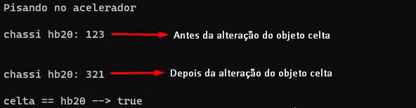

# Type Casting 

Converter o tipo de dado valor em outro tipo.

Converter uma variável do tipo double para uma variável do tipo int. Observe o exemplo abaixo:

**Código:**`

```
public class Typecasting {
    
    public static void main(String[] args) {

        double nota = 9.6;
        System.out.println("tipo double: " + nota);

        System.out.println("tipo int: " + (int) nota);
    }
}
```

**Saída de execução:**


# Upcasting

Quando realizamos um typecasting à instância de uma subclasse, convertendo a instância para o tipo de sua superclasse.

Observe o exemplo abaixo:

**Código:**

```
class Veiculo {

    public void freiar() {
        System.out.println("Acionando recursos de atrito");
    }
}

class Carro extends Veiculo{

    public void freiar() {
        System.out.println("Pisando no freio do carro");
    }

    public void diminuirVelocidade(){
        System.out.println("Retirando o pe do acelerador");
    }
}

public class Upcasting {
    
    public static void main(String[] args) {

        //Upcasting implicito:

        Veiculo hb20 = new Carro();

        //Mesmo que Veiculo hb20 = (Veiculo) new Carro();
    }
}
```

No exemplo acima, mesmo Carro() possuindo o método diminuirVelocidade(), o método não poderá ser chamado pela instância, uma vez que o upcasting ocorreu e que o tipo de variável da instância hb20 foi convertida do tipo Carro para o tipo Veiculo.

Além de detalhes como tamanho de ocupação do valor de uma variável na memória, um tipo de variável também é responsável por definir as operações específicas associadas a uma instância, tendo em vista que cada classe tem seu conjunto de métodos conhecidos e implementados.

Sendo asism, depois do upcasting, hb20 agora é do tipo Veiculo e a classe Veiculo() não tem nenhum método diminuirVelocidade() implementado. Log, o método não poderá ser chamado pelo objeto hb20, mesmo ele sendo uma instância de Carro().

Se a classe Veiculo() tivesse um método com a mesma assinatura, então, quando o método fosse chamado pela instancia cuja variavel é do tipo Veiculo mas o valor é um objeto da classe Carro(), ocorreria um override, e a implementação do método diminuirVelocidade() presente na classe Carro() iria sobrescrever a implementação na classe Veiculo().

Mas como Veiculo não possui esse método, e o typecasting ocorreu para a variável, mesmo que ela tenha como valor um objeto da classe Carro() que possui o método, o método não pode ser invocado, tendo em vista que a variável é do tipo Veiculo, ou seja, a classe Veiculo(), desconhece esse método.

# Downcasting

Quando realizamos um typecasting à instância de uma superclasse, convertendo a instância para o tipo de sua subclasse.

Seguindo a mesma lógica explicada no tópico de upcasting, temos que caso um objeto de uma subclasse seja instânciado e atribuido a uma variável com o tipo de sua superclasse, e essa superclasse não possua a assinatura de algum método da subclasse, esse método não poderá ser utilizado pelo objeto instanciado.

Sendo assim, o uso do downcasting poderá ser uma solução útil.

Observe o exemplo abaixo:

**Código:**

```
class Veiculo {

    String chassi;

    public void freiar() {
        System.out.println("Acionando recursos de atrito");
    }
}

class Carro extends Veiculo{

    public void acelerar() {
        System.out.println("Pisando no acelerador");
    }
}

public class Downcasting {
    
    public static void main(String[] args) {

        Veiculo celta = new Carro();
        celta.chassi = "123";
        
        //Downcasting para utilizar o método acelerar()
        Carro hb20 = (Carro) celta;
        hb20.acelerar();

        System.out.println("\nchassi hb20: " + hb20.chassi + "\n");

        //No downcasting a nova variável possui um tipo diferente, porém faz referência ao mesmo objeto
        celta.chassi = "321";
        System.out.println("\nchassi hb20: " + hb20.chassi + "\n");

        System.out.println("celta == hb20 --> " + celta.equals(hb20));
    }
}
```

**Saída de execução:**



Observe que a criação da nova instância "hb20" utilizando o downcasting na instância "celta" possibilitou o uso da função acelerar implementado na classe Carro().

Outra observação relevante, é que o downcasting possibilitou que a nova variável (hb20), de tipo Carro e não Veiculo, fizesse referência ao mesmo objeto (instanciado pela classe Veiculo()), o que dependendo do contexto e necessidade do programador, pode ser um recurso extremamente útil.

Isso significa que o desenvolvedor poderá empregar comportamentos específicos de uma determinada classe ao objeto de outra classe que não reconheça esse método sem precisar criar novas instâncias, tornando o processo mais simples e econômico para a memória.