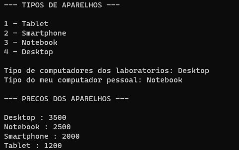

# Enumeradores (enums)

Em Java, uma enumeração (enum) é um tipo de dado especial que permite a definição de um conjunto fixo de constantes nomeadas. Enums são úteis quando você tem um conjunto de valores que representam estados, opções ou categorias distintas. Eles fornecem uma maneira mais limpa e segura de representar esses valores em comparação com o uso de constantes inteiras ou strings.

São úteis em situações em que você tem um conjunto conhecido de opções ou estados e deseja garantir que apenas esses valores específicos sejam utilizados.

As constantes nomeadas em um enum são na verdade objetos, e pode possuir atributos, e métodos relacionados, inclusive enums podem ter construtores (privados) que servem para definir os atributos desses objetos. 

Aqui estão algumas das principais finalidades e vantagens de usar enums:

* **Clareza do Código:** Enums melhoram a clareza do código, tornando-o mais legível e compreensível. Em vez de usar constantes int ou String para representar diferentes valores, você pode usar enums, que fornecem nomes descritivos para cada valor.

* **Segurança:** Enums oferecem segurança ao garantir que apenas os valores predefinidos na enumeração possam ser usados. Isso ajuda a evitar erros de digitação e problemas relacionados à atribuição de valores inválidos.

* **Facilita a Manutenção:** Se você precisar adicionar ou remover valores possíveis, a enumeração oferece um local centralizado para fazer essas alterações. Isso facilita a manutenção do código.

* **Suporte a Métodos e Campos:** Enums podem ter métodos e campos associados, tornando-os mais flexíveis do que simples constantes. Isso permite que você adicione comportamento específico a cada valor da enumeração.

* **Comparação Segura:** Enums em Java suportam comparações seguras usando o operador ==. Isso é mais seguro do que comparar strings ou valores inteiros, que podem levar a erros se os valores não forem comparados corretamente.

* **Facilita a Leitura de Código Fonte:** Ao usar enums, o código-fonte torna-se mais expressivo, e as intenções do programador ao escolher valores específicos são mais claras para outros desenvolvedores que revisam ou colaboram no código.

# Exemplo Básico

**Código:**

```
enum Computador {

    Tablet, Smartphone(2000, 20), Notebook(2500, 30), Desktop(3500, 40);

    /**
     * 
     * Construtores de uma classe com enumeradores criam os objetos (enumeradores) em si mesmas, por isso os contrutores são por padrão (de forma implicita) e OBRIGATORIAMENTE, privados (private). Logo, os contrutores apenas podem ser utilizados dentro das classes que possuem os enumeradores e por consequencia disso essas classes não podem ser instanciadas. Além disso, outras classes não podem extender/herdar classes de enumeradores.
     * 
     * Todas as classes de enumeradores extendem/herdam implicitamente a classe Enum, e tendo em vista que em Java não existe herança mútipla, classes de enumeradores não podem herdar/extender outras classes. Interfaces, por sua vez, são passíves de implementação por classes de enumeradores.
     * 
    */
    
     //Construtor padrão, assim enums como "Tablet" nao precisam ser inicializados como os demais
    Computador() {
        preco = 1200;
    }

    //Construtor que recebe argumentos
    Computador(int valor, int quantidade) {
        this.preco = valor;
        this.quantidade = quantidade;
    }

    private int preco;
    private int quantidade;

    public int getPreco() {
        return preco;
    }

    public void setPreco(int preco) {
        this.preco = preco;
        
    }

    public int getQuantidade() {
        return quantidade;
    }

    public void setQuantidade(int quantidade) {
        this.quantidade = quantidade;
    }
}

public class EnumsEmJava {

    public static void main(String[] args) {
        //=================================================================//

        //Enum.values()
        Computador tiposDeAparelhos[] = Computador.values();

        System.out.println("--- TIPOS DE APARELHOS ---\n");

        for(int cont=0; cont < tiposDeAparelhos.length; cont++) {

            System.out.println(cont+1 + " - " + tiposDeAparelhos[cont]);
        }
        System.out.println();

        //=================================================================//

        //=================================================================//

        //Enum.valueOf()
        /**
            O método Enum.valueOf(Class<T> enumType, String name) é um método estático fornecido pela classe Enum em Java. Ele é utilizado para obter uma constante enum pelo seu nome. Este método é geralmente usado quando você tem o nome da constante em forma de string e deseja obter a instância correspondente da enumeração.
         */

        Computador computadorLaboratorio = Computador.valueOf("Desktop");
        Computador computadorPessoal = Enum.valueOf(Computador.class, "Notebook");

        System.out.println("Tipo de computadores dos laboratorios: " + computadorLaboratorio);
        System.out.println("Tipo do meu computador pessoal: " + computadorPessoal);
        System.out.println();

        //=================================================================//

        Computador aparelho1 = Computador.Desktop;
        Computador aparelho2 = Computador.Notebook;
        Computador aparelho3 = Computador.Smartphone;
        Computador aparelho4 = Computador.Tablet;

        Computador aparelhos[] = { aparelho1, aparelho2, aparelho3, aparelho4 };

        System.out.println("--- PRECOS DOS APARELHOS ---\n");

        for(Computador aparelho : aparelhos) {
            
            switch(aparelho) {
                
                case Tablet -> System.out.println("Tablet : " + aparelho.getPreco());
                case Smartphone -> System.out.println("Smartphone : " + aparelho.getPreco());
                case Notebook -> System.out.println("Notebook : " + aparelho.getPreco());
                case Desktop -> System.out.println("Desktop : " + aparelho.getPreco());
            }
        }
    }
}
```

**Saída de execução:**

