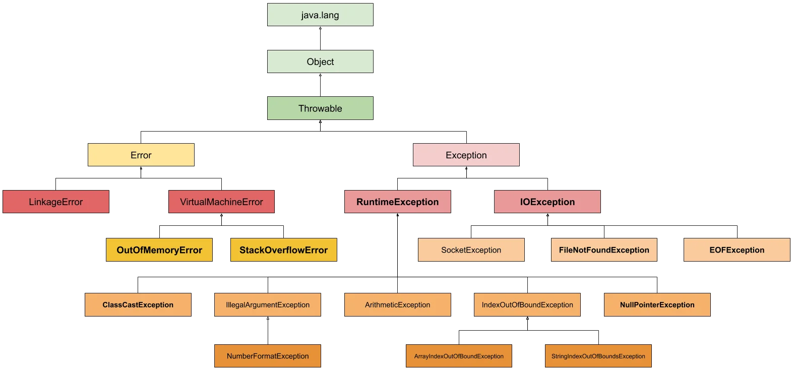

# Exceptions

Exceptions em Java são erros em tempo de execução de uma aplicação.

São eventos que indicam condições anormais ou erros durante a execução de um programa. Quando uma exceção ocorre, ela interrompe o fluxo normal de execução e procura por um bloco de código que pode tratá-la. Se o código não tratá-la, a exceção será propagada pela pilha de chamadas até que seja tratada ou até que o programa seja encerrado.

Existem dois tipos principais de exceções em Java:

1. **Checked Exceptions (Exceções Verificadas):**

* São exceções que o compilador exige que você trate explicitamente usando try-catch ou declarando que o método que as lança pode lançá-las (usando a palavra-chave throws).
Exemplos comuns incluem IOException, SQLException e ClassNotFoundException.

2. **Unchecked Exceptions (Exceções Não Verificadas):**

* Também conhecidas como RuntimeExceptions, essas exceções não precisam ser explicitamente tratadas pelo compilador, sendo assim o compilador não obriga o programador a tratá-las. Porém, como um bom programador, é uma boa prática tratar as possíveis exceptions de uma aplicação. Exemplos comuns incluem NullPointerException, ArrayIndexOutOfBoundsException e ArithmeticException.

**Errors** 

Errors são inrecuperáveis e intratáveis, significa que algo de muito grave ocorreu e o seu programa foi interrompido. Alguns exemplos de errors são OutOfMemoryError, VirtualMachineError, AssertionError etc.

# Hierarquia de Exceções

