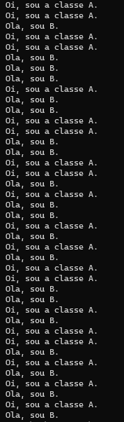
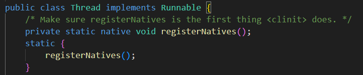
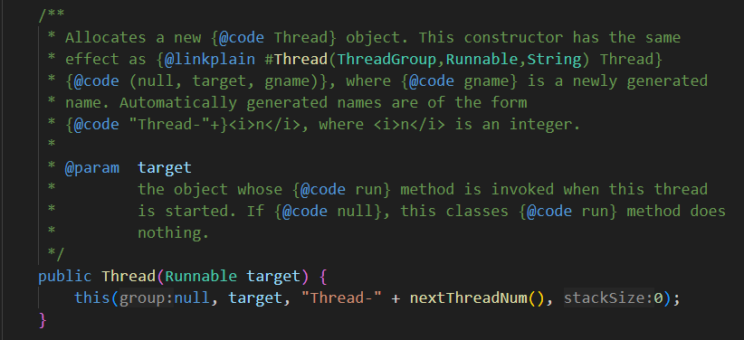
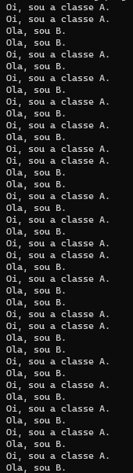
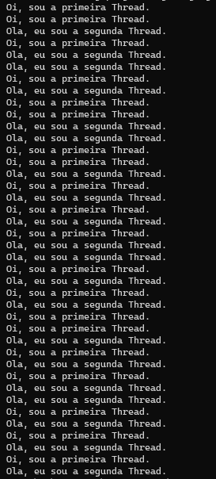
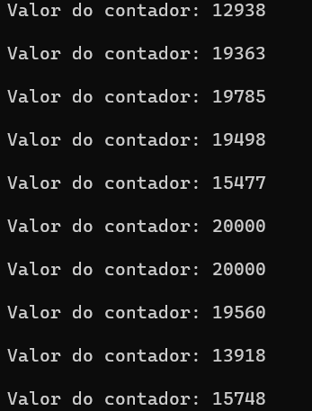
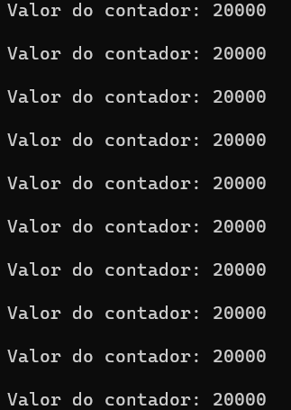
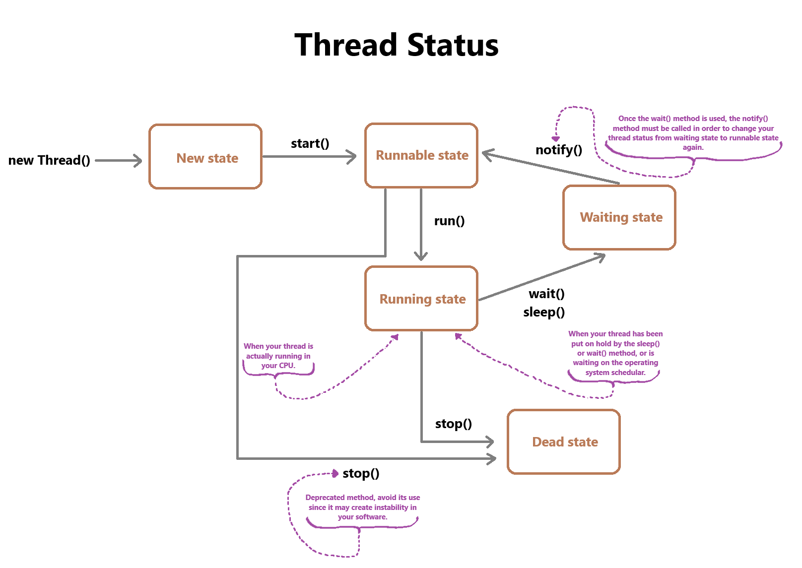

# Threads em Java

Uma thread é a menor unidade de uma determiada tarefa.

Em uma tarefa podem existir multiplas threads, que podem ser executadas paralelamente enquanto dividem recursos.

Em um programa/aplicação os comandos são executados em sequência (normalmente), porém podemos tentar os executar simultaneamente com multiplas threads, em Java isso não é possível com objetos normais, você precisa transforma-los em threads.

# Criando Threads com a Classe Thread

Se você deseja criar objetos como threads, basta extender a Thread à classe do objeto criado. No momento em que você herda a classe Thread, sua subclasse não será mais uma classe ordinária, ela será uma Thread. Em toda thread deve existir um método run(), que será executado toda vez que a instância da subclasse chamar o método start().

O no sistema operacional existe o conceito de schedular, que é responsável por organizar quais threads existentes serão executadas e quando. Com o método setPriority() podemos determinar a prioridade de uma determinada instância de Thread, sugerindo ao schedular do sistema operacional qual thread ele deve ou não priorizar.

O método setPriority() recebe valores inteiros de 1 a 10, sendo 10 o representante do nível mais alto de prioridade. Por padrão todas as threads terão prioridade normal, ou seja, 5. A classe Thread possui 3 constantes que podem ser utilizadas no setPriority(): MIN_PRIORITY, NORM_PRIORITY, MAX_PRIORITY.

O método sleep() também pode ser utilizado para interromper a execução de uma determinada thread por determinado tempo.

**Código:**

```
class A extends Thread {

    public void run() {
        for(int i=0; i<20; i++) {
            System.out.println("Oi, sou a classe A.");
            
            try { Thread.sleep(10); }
            catch(InterruptedException e) {}
        }
    }
}

class B extends Thread {

    public void run() {
        for(int i=0; i<20; i++) {
            System.out.println("Ola, sou B.");

            try { Thread.sleep(10); }
            catch(InterruptedException e) {}
        }
    }
}

public class ThreadsEmJava {
    
    public static void main(String[] args) {

        A instanciaA = new A();
        B instanciaB = new B();

        instanciaA.setPriority(Thread.MIN_PRIORITY + 9);
        instanciaB.setPriority(10);

        instanciaA.start();

        try { Thread.sleep(10); }
        catch(InterruptedException e) {}
        
        instanciaB.start();
    }
}
```

**Saída de execução:**



# Criando Threads com a Interface Runnable

Precisar extender a classe Thread para poder criar threads pode não ser possível caso sua classe precise extender outra classe Java, tendo em vista que não existe herança multipla em Java.

Se olharmos a documentação da classe Thread, iremos perceber que ela implementa a interface Runnable:



Além disso, a classe Thread possui diversos contrutores. Em um deles, um objeto do tipo Runnable é passado como parâmetro.



Sendo assim, podemos utilizar esses recursos para criarmos threads sem precisar herdar a classe Thread, mas sim implementar a classe Runnable nas classes a partir das quais iremos criar nossas threads.

Uma vez implementada a interface Runnable, sobrescrevos o método run(), instanciamos nossa classe definindo o tipo do objeto como Runnable, criamos uma instância da classe Thread passando como argumentos a instância que acabamos de criar, e chamamos o método start() na instancia da classe Thread.

Veja o exemplo: 

**Código:**

```
class A implements Runnable {

    public void run() {
        for(int i=0; i<20; i++) {
            System.out.println("Oi, sou a classe A.");
            
            try { Thread.sleep(10); }
            catch(InterruptedException e) {}
        }
    }
}

class B implements Runnable {

    public void run() {
        for(int i=0; i<20; i++) {
            System.out.println("Ola, sou B.");

            try { Thread.sleep(10); }
            catch(InterruptedException e) {}
        }
    }
}

public class ThreadsERunnableInterface {
    
    public static void main(String[] args) {

        Runnable instanciaA = new A();
        Runnable instanciaB = new B();

        Thread threadA = new Thread(instanciaA);
        Thread threadB = new Thread(instanciaB);

        threadA.start();

        try { Thread.sleep(10); }
        catch(InterruptedException e) {}
        
        threadB.start();
    }
}
```

**Saída de execução:**



# Threads, Runnable Interface & Lambda Functions

Se olharmos a documentação da interface Runnable iremos perceber que ela é uma interface funcional, ou seja, possui um único método abstrato, que é o método run().

Logo podemos usar uma função lambda para implementarmos o método run() no momento de instanciamento das instâncias da classe Thread, observe como podemos fazer isso:

**Código:**

```
public class ThreadsELambdaFunctions {
    
    public static void main(String[] args) {

        Runnable obj1 = () -> 
        {
            for(int i=0; i<20; i++) {
                System.out.println("Oi, sou a primeira Thread.");

                try { Thread.sleep(10); }
                catch(InterruptedException e) {}
            }
        };

        Runnable obj2 = () -> 
        {
            for(int i=0; i<20; i++) {
                System.out.println("Ola, eu sou a segunda Thread.");

                try { Thread.sleep(10); }
                catch(InterruptedException e) {}
            }
        };

        Thread threadA = new Thread(obj1);
        Thread threadB = new Thread(obj2);

        threadA.start();

        try { Thread.sleep(10); }
        catch(InterruptedException e) {}
        
        threadB.start();
    }
}
```

**Saída de execução:**



# Mutations em Java

Quando algo é passível de mutação significa que isso pode ser modificado, por exemplo, variáveis de tipo primitivo.

Threads modificando uma variável ou objeto ao mesmo tempo pode resultar em sérios problemas. Para previnir esse tipo de problema durante o uso de multiplas threads, podemos trabalhar com dados imutáveis ou utilizar métodos de thread-safe.

Thread safe significa que o ato de acessar e modificar os valores de dados ou de um dado para um valor correto ou incorreto através multiplas threads simultaneamente não é permitido. Ou seja, os dados só podem ser acessados e/ou modificados por uma única thread ao mesmo tempo.

Para garantir que seu método possa ser chamado apenas uma thread por vez use a keyword ***synchronized***. Ou seja, para transformar um método em um método thread-safe o defina utilizando a keyword *synchronized*.

## Exemplo antes do uso do conceito de Thread-Safety

**Código:**

```
class Contador {

    int valor;
    public void aumentarValor() { valor++; }
}

public class NotThreadSafe {
    
    public static void main(String[] args) {

        Contador meuContador = new Contador();

        Runnable obj1 = () -> { for(int i=0; i<10_000; i++){ meuContador.aumentarValor(); }; };
        Runnable obj2 = () -> { for(int i=0; i<10_000; i++){ meuContador.aumentarValor(); }; };

        Thread threadA = new Thread(obj1);
        Thread threadB = new Thread(obj2);

        threadA.start();
        threadB.start();

        try {
            threadA.join();
            threadB.join();

        } catch(InterruptedException e){}

        System.out.println("Valor do contador: " + meuContador.valor);
    }
}
```

**Saídas de execução (Para fins de exemplificação o códido foi executado 10 vezes):**



## Exemplo após uso do conceito de Thread-Safety

**Código:**

```
class Contador {

    int valor;
    public synchronized void aumentarValor() { valor++; }
}

public class SynchronizedKeyword {
    
    public static void main(String[] args) {

        Contador meuContador = new Contador();

        Runnable obj1 = () -> { for(int i=0; i<10_000; i++){ meuContador.aumentarValor(); }; };
        Runnable obj2 = () -> { for(int i=0; i<10_000; i++){ meuContador.aumentarValor(); }; };

        Thread threadA = new Thread(obj1);
        Thread threadB = new Thread(obj2);

        threadA.start();
        threadB.start();

        try {
            threadA.join();
            threadB.join();

        } catch(InterruptedException e){}

        System.out.println("Valor do contador: " + meuContador.valor);
    }
}
```

**Saídas de execução (Para fins de exemplificação o códido foi executado 10 vezes):**



#### Método join()

Para fazer com que o método main() espere que a execução das suas threads finalize antes de continuar sua execução, chame o método ***join()*** atraves das suas threads.

# Thread Status

Everytime you create a thread it goes into a **new state**, apart from this new state there's also something called **runnable state**, after that there's a **running state**, there's a **waiting state** (also referred as block state), and the last state is the **dead state**.

