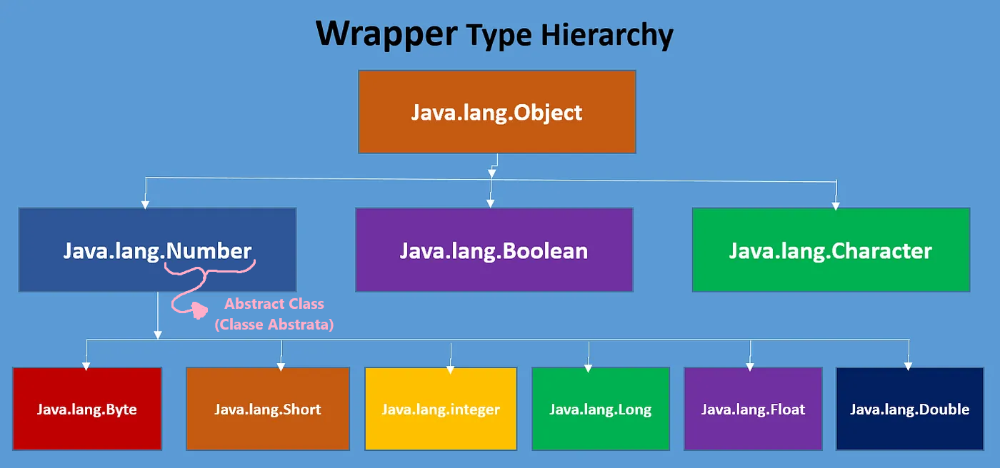

# Wrapper Classes

Java disponibiliza tipos primitivos de dados, como por exemplo, *int*, *double* e *char*. Esses tipos primitivos não herdam da classe Object() como qualquer outra classe em Java faz.

O fato dos valores primitivos serem do tipo primitivo e não do tipo objeto é benéfico porque isso ajuda a linguagem a melhorar sua performance, uma vez que esses tipos trabalham com valores fixos de armazenamento e não são salvos na memória heap como objetos, consumindo assim menos tempo e recursos durante sua execução.

Porém, existem algumas ferramentas e frameworks em Java que só trabalham com obejtos, collections são exemplos disso. Para solucionar esse impasse, existem as classes Wrapper, que herdam da classe Object(). Existe uma Wrapper class para cada tipo primitivo em Java.

Sendo assim, se você precisa de objetos para poder trabalhar com alguma ferramenta ou framework específico que apenas suporta objetos, faça uso das Wrapper classes. Se não, tente evitar seu uso e continue utilizando os tipos primitivos de dados, uma vez que isso irá melhorar a performance do seu programa.

## Hierarquia das Wrapper Classes



## Tabela das Wrapper Classes

| Tipo Primitivo | Wrapper Class | Argumentos do Construtor |
| --- | --- | --- |
| char | Character | char |
| byte | Byte | byte Or String |
| short | Short | short Or String |
| int | Integer | int Or String |
| long | Long | long Or String |
| float | Float | float, double Or String |
| double | Double | double Or String |
| boolean | Boolean | boolean Or String |

&nbsp;

# Boxing

O conceito de boxing consiste no ato de pegar um valor primitivo e armazena-lo em um objeto.

Observe o cógido abaixo, onde o valor primitivo "10" é atribuido à instância da Integer Wrapper class "ii":

```
public class ExemploDeBoxing {

    public static void main(String[] args) {
        
        Integer ii = 10;
    }
}
```

**Exemplo de unboxing:**

```
public class ExemploDeBoxing {

    public static void main(String[] args) {
        
        Integer ii = 10;
        
        //Retornando o valor primitivo para a variável pv
        int pv = ii.intValue();
    }
}
```

## Auto-boxing

É a conversão automática que o compilador Java realiza entre os tipos primitivos e suas respectivas wrapper classes.

Observe o cógido abaixo, onde o valor primitivo armazenado em "pv" será convertido como valor de instância da Integer Wrapper class "ii":

```
public class ExemploDeAutoboxing {

    public static void main(String[] args) {
        
        int pv = 10;
        Integer ii = pv;
    }
}
```

**Exemplo de auto-unboxing:**

```
public class ExemploDeBoxing {

    public static void main(String[] args) {
        
        Integer ii = 10;
        
        //Retornando o valor primitivo para a variável pv automaticamente
        int pv = ii;
    }
}